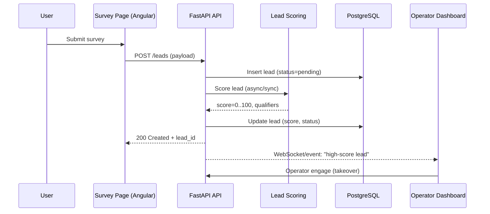

<!-- Created: 2026-03-14T20:44:39Z -->
# Architecture — ACE Real Estate

System overview
```mermaid
graph TD
    User[User] -->|Survey| SurveyPage[Survey Page (Angular)]
    SurveyPage --> API[FastAPI Backend]
    API --> DB[(PostgreSQL)]
    API --> LeadScoring[Lead Scoring Service]
    LeadScoring --> OperatorDash[Operator Dashboard]
    OperatorDash --> API
```

Lead qualification flow


Key technical points
- Multi-tenant isolation with per-tenant flows and assets
- Node-based conversation engine with AI-assisted scoring
- Event-driven operator handoff to dashboard (WebSocket/events)
- Dockerized local stack (Postgres + FastAPI + UIs)
