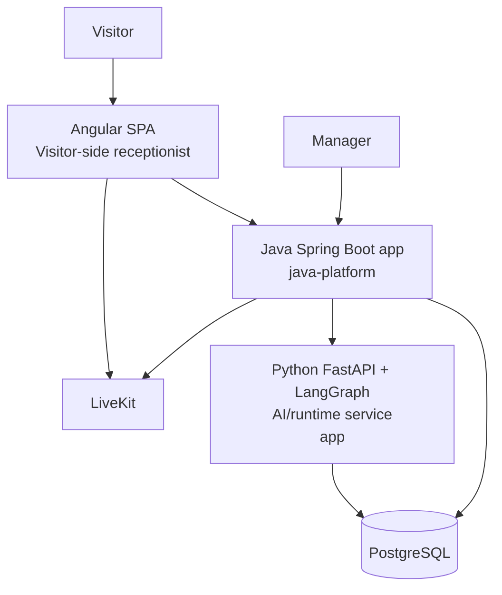
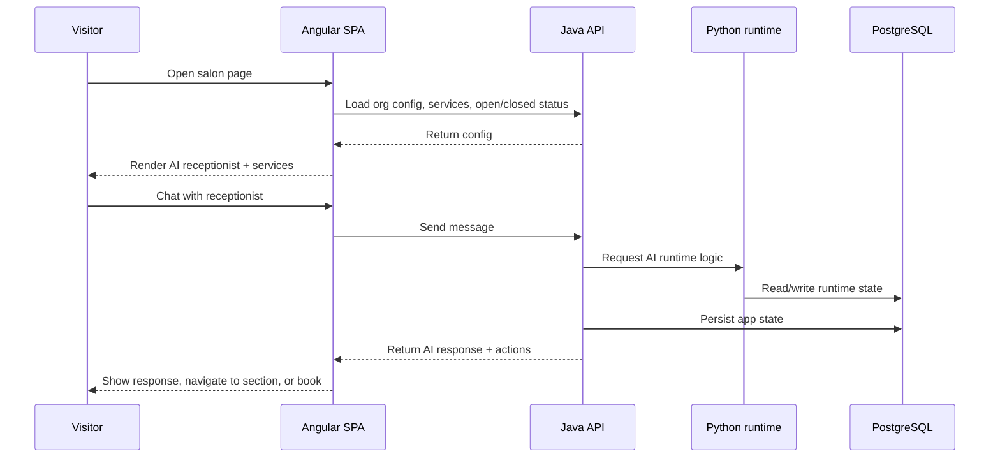
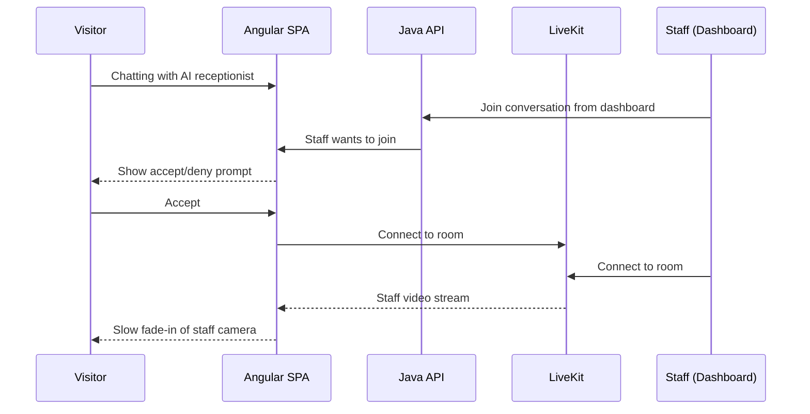
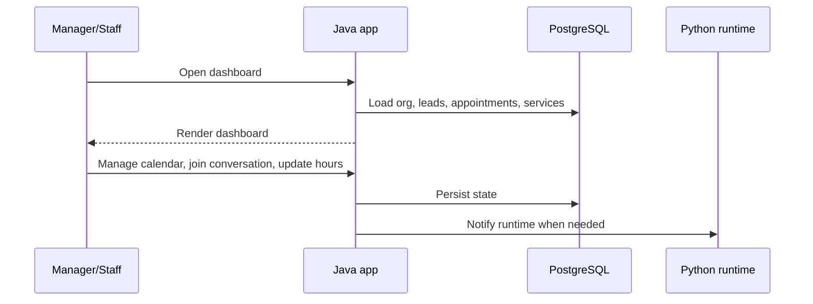

# Architecture — ACE Reception Services

ACE Reception Services is an **AI receptionist platform for Slovenian beauty salons (kozmeticni saloni)** and similar appointment-based service businesses. It replaces the front-desk experience online: greet, qualify, book, and hand off to human staff — all in one flow.

It is built with an **Angular visitor SPA**, a **Java Spring Boot backend + dashboard**, and a **Python AI/runtime service powered by FastAPI and LangGraph**.

## High-level view

```mermaid
graph TD
    Visitor[Visitor] --> Angular[Angular SPA\nVisitor-side receptionist]
    Manager[Manager] --> Java[Java Spring Boot app\njava-platform]
    Angular --> Java
    Java --> Postgres[(PostgreSQL)]
    Java --> Python[Python FastAPI + LangGraph\nAI/runtime service\napp]
    Java --> LiveKit[LiveKit]
    Angular --> LiveKit
    Python --> Postgres
```

## Responsibility split

### `angular-visitor/` (planned)
Visitor-side single-page application.

Owns the salon visitor experience:
- AI receptionist chat widget (middle-bottom of page)
- service browsing (3 demo services with AI-generated photos)
- calendar / appointment booking
- open/closed hours awareness with live status
- live staff video handoff (slow fade-in, accept/deny controls)
- request-a-human button

### `java-platform/`
Primary application backend + manager dashboard.

Owns:
- REST API for the Angular visitor SPA
- login and auth
- manager/salon dashboard (Thymeleaf SSR)
- calendar and appointment management UI
- lead thread and takeover flow
- live-help session orchestration
- organization and service management

### `app/`
Python AI/runtime service.

Owns:
- AI receptionist conversational logic
- LangGraph-based runtime orchestration
- intent qualification (service selection, booking, questions)
- event/runtime support paths
- service behavior that the Java app calls when AI processing is needed

### PostgreSQL
Shared persistence layer for the application and runtime service.

### LiveKit
Supports live staff video handoff — staff camera fades in smoothly, visitor can accept or deny.

## Example flows

### Visitor reception flow

```mermaid
sequenceDiagram
    participant V as Visitor
    participant A as Angular SPA
    participant J as Java API
    participant P as Python runtime
    participant DB as PostgreSQL

    V->>A: Open salon page
    A->>J: Load org config, services, open/closed status
    J-->>A: Return config
    A-->>V: Render AI receptionist + services
    V->>A: Chat with receptionist
    A->>J: Send message
    J->>P: Request AI runtime logic
    P->>DB: Read/write runtime state
    J->>DB: Persist app state
    J-->>A: Return AI response + actions
    A-->>V: Show response, navigate to section, or book
```

### Staff handoff flow

```mermaid
sequenceDiagram
    participant V as Visitor
    participant A as Angular SPA
    participant J as Java API
    participant L as LiveKit
    participant M as Staff (Dashboard)

    V->>A: Chatting with AI receptionist
    M->>J: Join conversation from dashboard
    J->>A: Staff wants to join
    A-->>V: Show accept/deny prompt
    V->>A: Accept
    A->>L: Connect to room
    M->>L: Connect to room
    L-->>A: Staff video stream
    A-->>V: Slow fade-in of staff camera
```

### Manager dashboard flow

```mermaid
sequenceDiagram
    participant M as Manager/Staff
    participant J as Java app
    participant DB as PostgreSQL
    participant P as Python runtime

    M->>J: Open dashboard
    J->>DB: Load org, leads, appointments, services
    J-->>M: Render dashboard
    M->>J: Manage calendar, join conversation, update hours
    J->>DB: Persist state
    J->>P: Notify runtime when needed
```

## Repository map
- `java-platform/` — backend API + manager dashboard
- `app/` — Python AI/runtime service
- `angular-visitor/` — visitor-side Angular SPA (planned)
- `ace-mobile/` — existing Ionic/Angular mobile companion
- `docs/` — documentation
- `scripts/` — helper scripts
- `docker-compose-simple.yml` — local infra for PostgreSQL + LiveKit

## Practical reading order
1. `README.md`
2. `Reception-Services.txt` — project goal & north star
3. `docs/PRODUCT_OVERVIEW.md`
4. `docs/LOCAL_DEVELOPMENT.md`
5. `docs/API_OVERVIEW.md`
