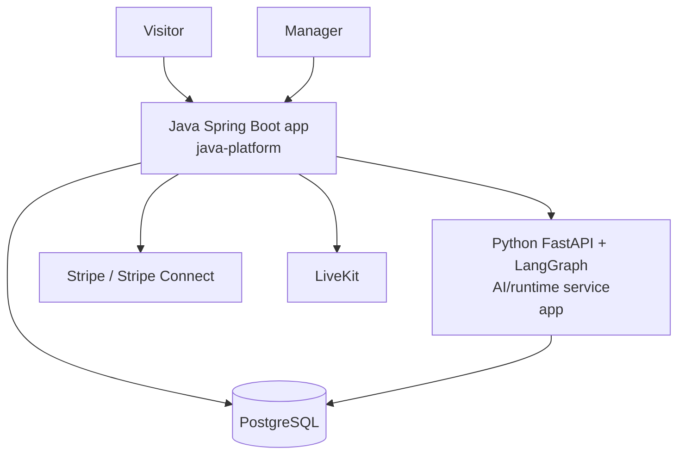
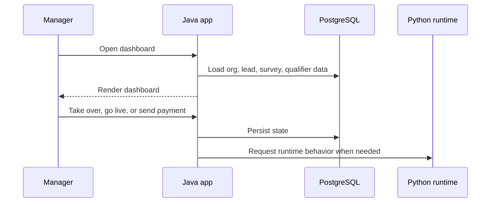
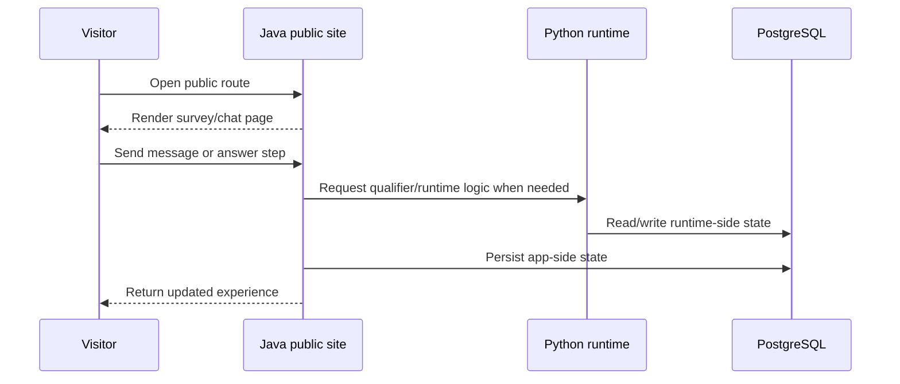
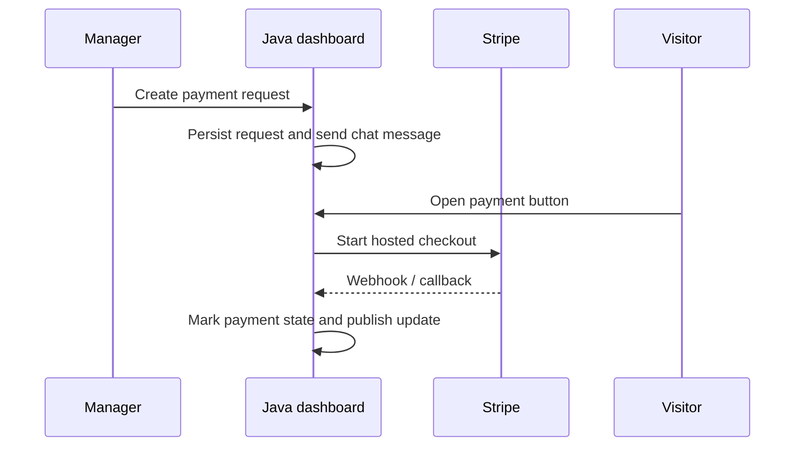

# Architecture — ACE e-Counter

ACE e-Counter is built as a **Java-first product application** with a separate **Python AI/runtime service powered by FastAPI and LangGraph**.

## High-level view

```mermaid
graph TD
    Visitor[Visitor] --> Java[Java Spring Boot app\njava-platform]
    Manager[Manager] --> Java
    Java --> Postgres[(PostgreSQL)]
    Java --> Python[Python FastAPI + LangGraph\nAI/runtime service\napp]
    Java --> Stripe[Stripe / Stripe Connect]
    Java --> LiveKit[LiveKit]
    Python --> Postgres
```

## Responsibility split

### `java-platform/`
Primary application.

Owns the main product surface:
- login and auth
- public visitor pages
- organization dashboard
- surveys and qualifier management UI
- lead thread and takeover flow
- live-help session UI flow
- payment request flow and public payment pages

### `app/`
Python AI/runtime service.

Owns:
- AI-assisted qualification/runtime logic
- LangGraph-based runtime orchestration
- event/runtime support paths
- service behavior that the Java app can call when AI/runtime processing is needed

### PostgreSQL
Shared persistence layer for the application and runtime service.

### LiveKit
Supports live-help transport in demo and local environments.

### Stripe
Handles payment request checkout and Connect/onboarding flow.

## Example flows

### Manager dashboard flow

```mermaid
sequenceDiagram
    participant M as Manager
    participant J as Java app
    participant DB as PostgreSQL
    participant P as Python runtime

    M->>J: Open dashboard
    J->>DB: Load org, lead, survey, qualifier data
    J-->>M: Render dashboard
    M->>J: Take over, go live, or send payment
    J->>DB: Persist state
    J->>P: Request runtime behavior when needed
```

### Visitor qualification flow

```mermaid
sequenceDiagram
    participant V as Visitor
    participant J as Java public site
    participant P as Python runtime
    participant DB as PostgreSQL

    V->>J: Open public route
    J-->>V: Render survey/chat page
    V->>J: Send message or answer step
    J->>P: Request qualifier/runtime logic when needed
    P->>DB: Read/write runtime-side state
    J->>DB: Persist app-side state
    J-->>V: Return updated experience
```

### Payment flow

```mermaid
sequenceDiagram
    participant M as Manager
    participant J as Java dashboard
    participant S as Stripe
    participant V as Visitor

    M->>J: Create payment request
    J->>J: Persist request and send chat message
    V->>J: Open payment button
    J->>S: Start hosted checkout
    S-->>J: Webhook / callback
    J->>J: Mark payment state and publish update
```

## Repository map
- `java-platform/` — main application
- `app/` — Python runtime service
- `docs/` — documentation
- `scripts/` — helper scripts
- `docker-compose-simple.yml` — local infra for PostgreSQL + LiveKit

## Practical reading order
1. `README.md`
2. `docs/PRODUCT_OVERVIEW.md`
3. `docs/LOCAL_DEVELOPMENT.md`
4. `docs/API_OVERVIEW.md`
