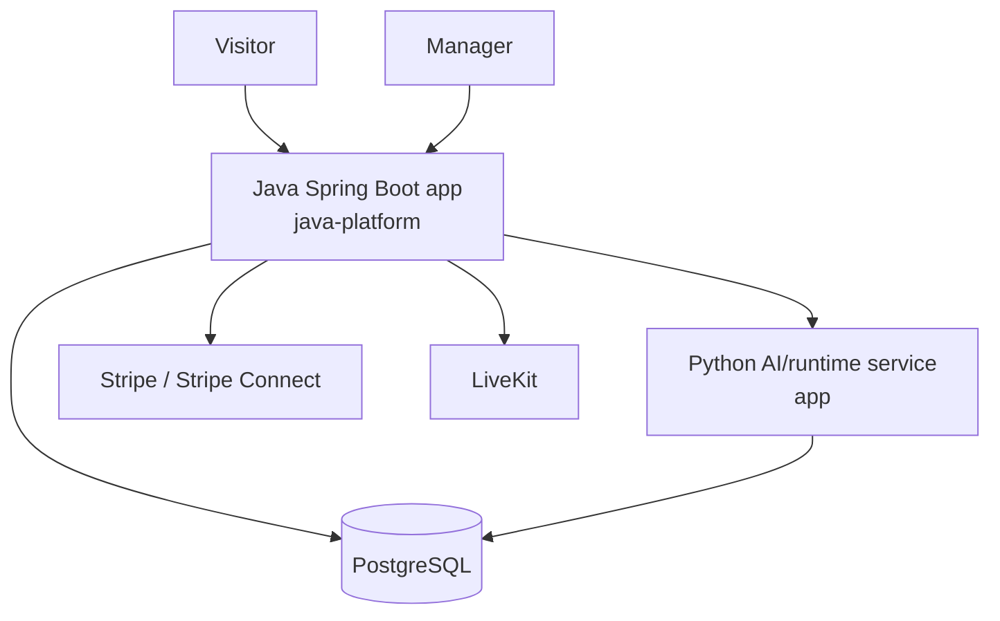
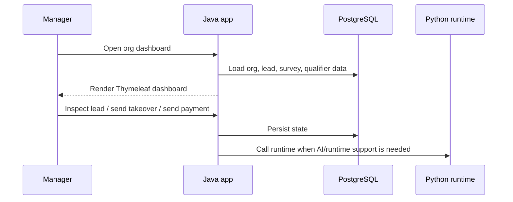
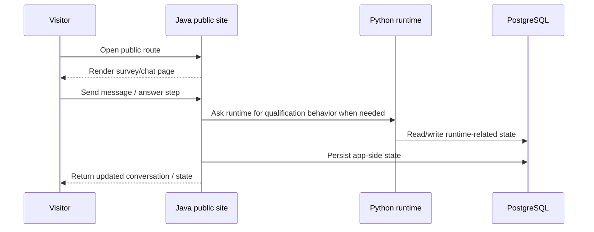
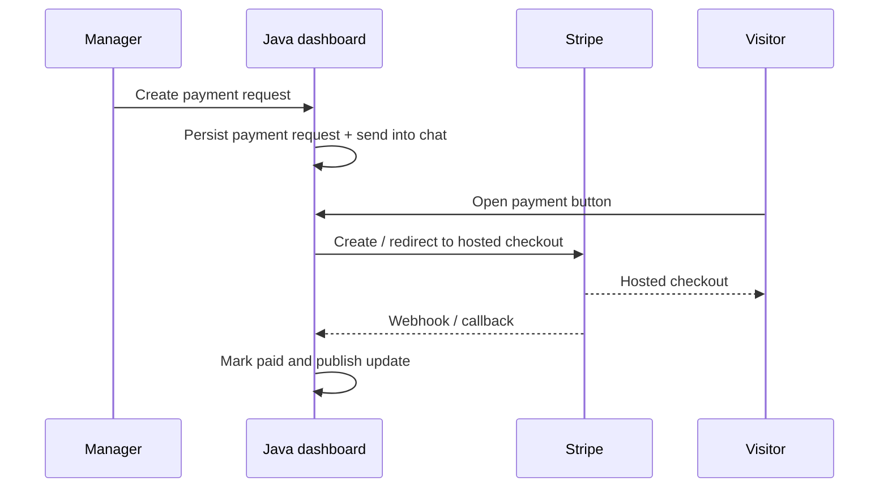

# Architecture — ACE e-Counter

This document describes the **current architecture truth**.

The project is no longer best described as “Angular frontend + Python backend”.

Current truth:
- the main product app is **Java Spring Boot** in `java-platform/`
- the AI/runtime side is **Python FastAPI** in `app/`
- some legacy Angular and Python-first surfaces still remain in the repo during transition

## High-level system

```mermaid
graph TD
    Visitor[Visitor] --> Java[Java Spring Boot app\njava-platform]
    Manager[Manager] --> Java
    Java --> Postgres[(PostgreSQL)]
    Java --> Python[Python AI/runtime service\napp]
    Java --> Stripe[Stripe / Stripe Connect]
    Java --> LiveKit[LiveKit]
    Python --> Postgres
```

## Responsibility split

### Java app (`java-platform/`)
Primary product surface.

Owns most of the app users actually touch:
- login and auth
- org dashboard
- public visitor pages
- survey CRUD and public survey delivery
- qualifier management UI
- lead thread and takeover UI
- live-help stage UI and current session flow
- payment request UI and public payment pages
- Stripe callback/webhook endpoints in the Java app path

### Python service (`app/`)
AI/runtime and transitional support layer.

Main responsibilities now:
- AI qualifier/runtime behavior
- supporting runtime flows and event paths
- some legacy APIs still not migrated
- transitional integration support while Java keeps absorbing product ownership

### Database
Shared PostgreSQL.

Important current local detail:
- legacy Python stack historically used `ace_production`
- Java app currently expects and migrates against `ace_platform`
- for local Java work, use `ace_platform`

### Live help transport
LiveKit is used for current local/demo live-help transport.

### Payments
Stripe-hosted checkout is used for payment requests.
Current flow supports:
- Stripe Connect path
- platform/demo fallback path when the connected account is not fully ready

## Request / feature flow examples

### 1. Manager dashboard flow

```mermaid
sequenceDiagram
    participant M as Manager
    participant J as Java app
    participant DB as PostgreSQL
    participant P as Python runtime

    M->>J: Open org dashboard
    J->>DB: Load org, lead, survey, qualifier data
    J-->>M: Render Thymeleaf dashboard
    M->>J: Inspect lead / send takeover / send payment
    J->>DB: Persist state
    J->>P: Call runtime when AI/runtime support is needed
```

### 2. Visitor qualification flow

```mermaid
sequenceDiagram
    participant V as Visitor
    participant J as Java public site
    participant P as Python runtime
    participant DB as PostgreSQL

    V->>J: Open public route
    J-->>V: Render survey/chat page
    V->>J: Send message / answer step
    J->>P: Ask runtime for qualification behavior when needed
    P->>DB: Read/write runtime-related state
    J->>DB: Persist app-side state
    J-->>V: Return updated conversation / state
```

### 3. Payment flow

```mermaid
sequenceDiagram
    participant M as Manager
    participant J as Java dashboard
    participant S as Stripe
    participant V as Visitor

    M->>J: Create payment request
    J->>J: Persist payment request + send into chat
    V->>J: Open payment button
    J->>S: Create / redirect to hosted checkout
    S-->>V: Hosted checkout
    S-->>J: Webhook / callback
    J->>J: Mark paid and publish update
```

## Current repo truth

### Primary code
- `java-platform/`
- `app/`

### Transitional / legacy code
- `frontend/ACE-Chatbot/`
- `frontend/manager-dashboard/`
- `portal/portal/`
- older compose/dev flows centered around the Angular/Python-first setup

These still exist, but they are no longer the best description of the current product.

## What employers / reviewers should understand
This repo shows a product in active re-platforming:
- from older Angular/Python-first delivery
- toward a Java-centered application
- while keeping Python where it still adds value most: AI/runtime behavior

That split is intentional.
It is now the correct mental model for the project.
