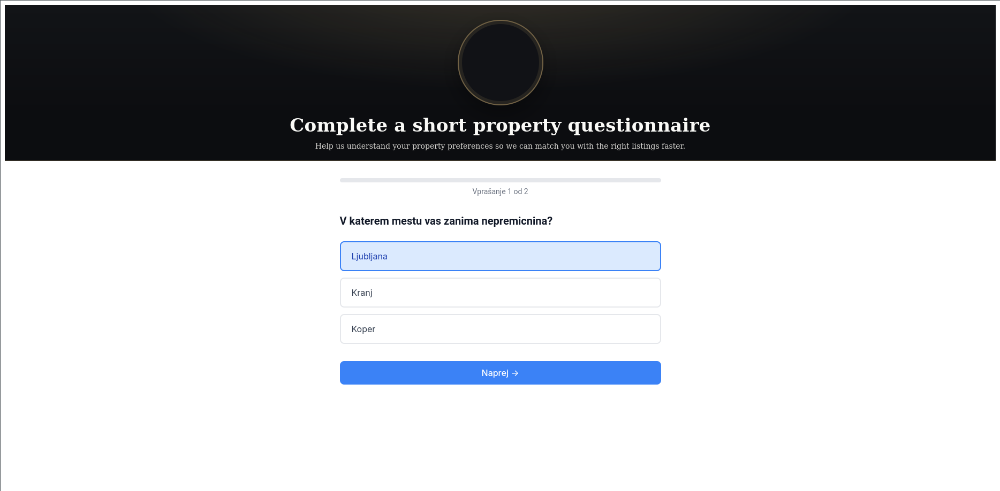
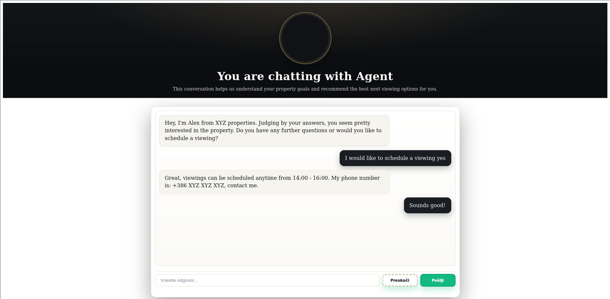
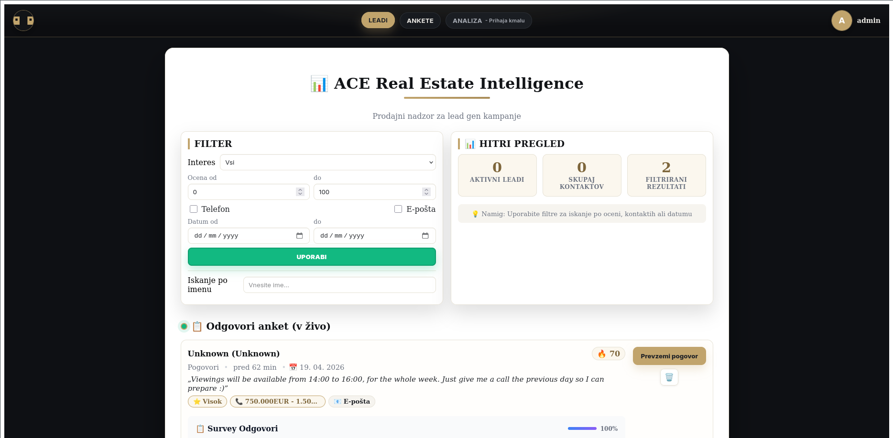

<!-- Created: 2026-03-14T20:44:39Z -->
# ACE Real Estate
A multi-tenant real-estate lead qualification platform with a customer chatbot, manager dashboard, and tenant-aware backend.  
It demonstrates end-to-end product engineering: multi-app frontend architecture, DB-backed configuration, AI-assisted qualification, event-driven handoff, and containerized local deployment.


## At a Glance
- **Built now:** manager-driven AI qualifier MVP with open chat mode, structured lead extraction, deterministic scoring, and dashboard visibility
- **Architecture:** FastAPI + PostgreSQL backend, Angular chatbot + manager dashboard, Dockerized local stack
- **Why it matters:** shows how to design a configurable, multi-tenant product instead of a one-off chatbot demo
- **In progress:** 🚧 V izdelavi: LangChain AI kvalifikacija

## Problem
Real-estate teams lose time and revenue when inbound leads are qualified manually and followed up too late.

## Update
- ✅ Manager-driven AI qualifier MVP is now integrated into the product
- 🚧 V izdelavi: LangChain AI kvalifikacija
- 🚧 Next up: grounded listing/retrieval answers and non-intrusive takeover/video escalation

## Solution
ACE Real Estate automates intake, qualification, and routing:
- Customer-facing chatbot can run either survey intake or open AI qualification
- Backend scores, stores, and continuously enriches lead profiles
- Manager dashboard gets real-time high-value lead signals and qualifier reasoning
- Admin portal manages tenant-specific configuration

## Tech Stack
- Backend: Python, FastAPI
- Frontend: Angular (3 separate applications)
- Database: PostgreSQL
- Runtime: Docker Compose
- Core patterns: multi-tenancy, role-based APIs, configuration-driven flow logic, event/WebSocket handoff

## System Components
- `frontend/ACE-Chatbot` — customer-facing lead intake UI
- `frontend/manager-dashboard` — operator/manager dashboard
- `portal/portal` — admin portal
- `app/` — API, services, auth, orchestration
- `data/` — conversation flow/configuration files

## Quick Start (recommended)
Use the simplified compose setup for local development:

1. Create env file:
   ```bash
   cp .env.example .env
   ```
2. Start services:
   ```bash
   docker compose -f docker-compose-simple.yml up -d --build
   ```
3. Open applications:
   - Chatbot UI: `http://localhost:4200`
   - Manager dashboard: `http://localhost:4400`
   - Admin portal: `http://localhost:4500`
   - API docs: `http://localhost:8000/docs`

## AI Qualifier Snapshot
The current first-step AI qualifier implementation adds a manager-driven, DB-backed qualification system:
- live qualifier per organization
- free-text chat mode when a live qualifier exists
- LangGraph-style runtime: `extract -> score -> reply`
- LLM extraction + LLM reply generation
- deterministic lead scoring / banding / takeover flags
- manager dashboard editor for qualifier goals, tone, fields, and thresholds
- manager lead view with score, confidence, reasoning, takeover/video eligibility

See also:
- `docs/AI_QUALIFIER_SPEC.md`
- `docs/DATA_CONTRACTS.md`
- `docs/EVENTS.md`
- `docs/VIDEO_TAKEOVER_SPEC.md`

## Product Demo
### 1) Survey Intake

User can still start with a short property questionnaire when no active AI qualifier is configured.

### 2) Open AI Qualification Chat

When an organization has a live qualifier, the chatbot starts directly in free-text mode and qualifies the lead conversationally.

### 3) Manager Dashboard

Managers can configure qualifiers and inspect lead profile quality, confidence, reasoning, and takeover status.

### 4) Screencast (1 minute)
- [Watch product walkthrough video (WebM)](docs/media/ace-demo-1min.webm)

## What This Project Demonstrates
- Building and shipping a multi-app product, not just isolated scripts
- Designing a multi-tenant backend with role-specific interfaces
- Implementing event-driven handoff from intake to operator workflows
- Running reproducible full-stack local environments with Docker

## Engineering Highlights
- Multi-tenant architecture with per-tenant isolation and configurable flows
- Node-based conversation logic with AI-assisted scoring support
- Real-time lead escalation to operators
- Modular service-oriented backend structure
- Fully containerized local stack for reproducibility

## Documentation
- Architecture diagrams: `ARCHITECTURE.md`
- Local setup and runbook: `docs/LOCAL_DEVELOPMENT.md`
- API route map: `docs/API_OVERVIEW.md`
- Stripe Connect local setup: `docs/STRIPE_CONNECT_LOCAL_SETUP.md`
- AI qualifier spec: `docs/AI_QUALIFIER_SPEC.md`
- AI qualifier data contracts: `docs/DATA_CONTRACTS.md`
- Qualifier/takeover events: `docs/EVENTS.md`
- Video takeover spec: `docs/VIDEO_TAKEOVER_SPEC.md`
- Recruiter/product presentation guide: `docs/PROJECT_PRESENTATION.md`
- GitHub launch pack (profile + pinned repo text): `docs/GITHUB_LAUNCH_PACK.md`
- Archived legacy docs: `docs/archive/README.md`

## Repository Map
- `app/` — FastAPI routers, services, auth, portal routes, middleware
- `frontend/ACE-Chatbot/` — intake/chat UI
- `frontend/manager-dashboard/` — manager UI
- `portal/portal/` — admin UI
- `scripts/` — operational scripts and helpers
- `static/` — static assets

## Notes
- Keep secrets out of git (`.env` is local-only)
- Use `.env.example` as the template
- Prefer `docker-compose-simple.yml` for onboarding and demos
- For local Stripe Connect testing, expose the backend publicly and keep dashboard/chatbot local

## Author
Maks Ponikvar

## Contact
- Email: `maks.ponikvar@gmail.com`
- GitHub: `https://github.com/Codere11`
